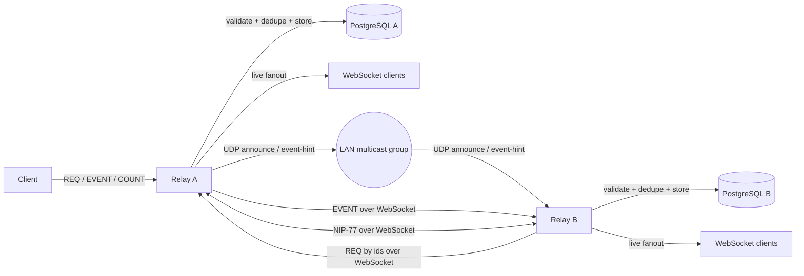

# Local-First Sync & Performance Engine for Nostream

**Applicant:** Mahmoud Khedr  
**Email:** [mahmoud.s.khedr.2@gmail.com](mailto:mahmoud.s.khedr.2@gmail.com)  
**Location:** Menoufia, Egypt  
**Timezone:** Africa/Cairo  
**GitHub:** [Mahmoud-s-Khedr](https://github.com/mahmoud-s-khedr)  
**Telegram:** [@m_s_khedr](https://t.me/m_s_khedr)  
**Discord:** mahmoudkhedr_  
**LinkedIn:** [mahmoud-s-khedr](https://www.linkedin.com/in/mahmoud-s-khedr/)  
**Blog:** [muhandis.software](https://muhandis.software/)  
**University:** Faculty of Electronic Engineering, Menoufia University  
**Degree:** B.E. in Computer Engineering, undergraduate, expected March 2027  

---

## Supporting Video

I included a short supporting video to help the mentor quickly understand the project scope, architecture, execution plan, and why I am prepared to deliver it.

**Video:** [Proposal Walkthrough – Local-First Sync & Performance Engine](https://youtu.be/f6E7JnHAn-E)

---

## Synopsis

This proposal extends Nostream with a mergeable local-first synchronization path: indexed NIP-50 search, opt-in LAN relay discovery over UDP multicast, bounded event-hint propagation, and NIP-77 Negentropy reconciliation for efficient repair after missed propagation.

The design is intentionally layered:

* **PostgreSQL** handles indexed NIP-50 search and query-plan validation.
* **UDP multicast** handles local discovery and lightweight event hints.
* **WebSockets** handle full event transfer between relays.
* **NIP-77 Negentropy** handles efficient reconciliation after packet loss, restart, or divergence.

---

## Motivation

This project addresses three practical gaps in Nostream's relay architecture.

First, clients need better text-based discovery than exact tag, author, kind, or event ID matching. NIP-50 adds a standard `search` filter, and PostgreSQL full-text search provides a practical path to implement it efficiently.

Second, local relays should be able to discover each other without brittle manual configuration. UDP multicast is useful for this, but the safest default implementation is to use it for discovery and small event-availability hints, then fetch full events over WebSocket.

Third, real-time propagation alone does not ensure eventual convergence after packet loss, restart, or temporary divergence. NIP-77 provides an efficient reconciliation path so peers can repair missed state without replaying everything.

---

## Current State vs Target State

| Area                  | Current State                            | Target State                                                                                      |
| --------------------- | ---------------------------------------- | ------------------------------------------------------------------------------------------------- |
| Search                | No NIP-50 search support                 | Indexed NIP-50 search support for `REQ`, with the same search predicate applied to NIP-45 `COUNT` |
| Query performance     | Existing filter-based PostgreSQL queries | Full-text-search-backed search with benchmarked query plans                                       |
| Local relay awareness | Manual/static peer configuration         | Opt-in LAN peer discovery over UDP multicast                                                      |
| Local propagation     | WebSocket pub/sub inside a relay         | Event-availability hints between LAN relays                                                       |
| Event transfer        | Client-relay WebSocket flow              | Relay-to-relay fetch by `ids` over WebSocket                                                      |
| Repair after loss     | No Negentropy-based local repair path    | Bounded NIP-77 reconciliation                                                                     |
| Testing               | Mostly single-relay behavior             | Multi-relay discovery, propagation, restart recovery, and convergence tests                       |

---

## High-Level Architecture



The architecture is intentionally layered: PostgreSQL handles search, UDP handles discovery and event hints, WebSockets transfer full events, and NIP-77 repairs missed state.

---

## Project Plan

The project is structured into a validation phase and four implementation phases. The goal is to land mergeable increments early instead of postponing all systems risk until the end.

The **required summer scope** is:

* End-to-end **NIP-50 search** for `REQ`, with the same search predicate applied to NIP-45 `COUNT` queries for consistent result counts.
* PostgreSQL full-text search migration using **GIN as the default index strategy**, with GiST evaluated if benchmarks or mentor feedback justify it.
* Opt-in **UDP multicast local sync** for LAN discovery, peer announcements, goodbye messages, and bounded event hints.
* WebSocket-based full event fetching after event hints.
* Minimal but functional **NIP-77 reconciliation** over WebSockets for discovered local peers.
* Multi-relay integration tests proving discovery, event-hint propagation, deduplication, restart recovery, and convergence.

The default UDP implementation will use UDP multicast for discovery and event-availability hints, then fetch full events over WebSocket. This keeps the required path safe and reliable while still enabling local relay propagation. If mentor feedback requires closer Notedeck parity for small full-event UDP payloads, I will implement it behind explicit configuration, strict packet-size limits, and the same validation and deduplication path.

Full-event UDP payloads, advanced search extensions, Arabic-aware normalization, extended observability, WASM/native Negentropy bindings, and remote/static mirror reuse remain stretch work unless mentor feedback or benchmark results justify moving any of them into the main scope.

---

## Phase 0 — Baseline Measurement and Design Validation

Before implementation, I will validate the integration points, collect baseline measurements, and confirm the smallest safe design for the search, multicast, and reconciliation layers.

Work items:

* Map current filter validation, repository query, count, live matching, WebSocket fanout, and worker-dispatch paths.
* Capture baseline PostgreSQL query plans for common relay filters and counts.
* Scaffold the multi-relay test harness early so it can be reused in the UDP and NIP-77 phases.
* Confirm the Negentropy strategy: JS-first behind an adapter boundary, with WASM/native bindings treated as stretch work.
* Review Notedeck's multicast behavior and map the relevant discovery, event-notification, dedupe, loop-prevention, and shutdown behavior into Nostream's worker model.

This phase reduces implementation risk before touching performance-sensitive query paths or network behavior.

---

## Phase 1 — NIP-50 Search and PostgreSQL Optimization

### Goal

Implement NIP-50 search for `REQ` using PostgreSQL full-text search, relevance-ranked results, live matching support, tests, and benchmarks. Because Nostream also supports NIP-45 `COUNT`, I will apply the same search predicate to count queries so clients can retrieve both matching results and matching result counts consistently.

NIP-50 adds a `search` filter field, allows other filters such as `kinds` and `ids` to restrict search results, and recommends ordering search results by result quality rather than normal `created_at` ordering.

### Work Items

* Add `search?: string` to the `SubscriptionFilter` interface in `src/@types/subscription.ts`.
* Add `search` as an explicit `z.string().optional()` field in the `filterSchema` `.object({...})` definition in `src/schemas/filter-schema.ts`, **before** the `.catchall()`. This is necessary because the current `.catchall(z.array(z.string().min(1).max(1024)))` expects every unknown key to be an array of strings, but NIP-50's `search` is a plain string. Adding `search` as an explicit field in the object definition means Zod will parse it before the catchall applies.
* Add `'search'` to the `knownFilterKeys` set so the `superRefine` validator does not reject it as an unknown key.
* Update `applyFilterConditions()` in `src/repositories/event-repository.ts` to add a `WHERE to_tsvector('simple', coalesce(event_content, '')) @@ plainto_tsquery('simple', ?)` predicate when `search` is present.
* Update `findByFilters()` so that when `search` is present, results are ranked by `ts_rank()` with deterministic tie-breakers (`event_created_at DESC`, then `event_id ASC`), while non-search queries preserve existing time-based ordering.
* Update `countByFilters()` to apply the same full-text-search predicate without rank calculation or search-specific ordering.
* Note the existing asymmetry: `countByFilters()` filters out deleted and expired events (`whereNull('events.deleted_at')`, `expires_at` check), but `findByFilters()` does not. The search predicate will be added consistently to both paths through `applyFilterConditions()`, but this existing asymmetry will be preserved rather than changed in this phase.
* Add a PostgreSQL full-text search index over `event_content`.
* Update live in-memory subscription matching in `isEventMatchingFilter()` (`src/utils/event.ts`) with conservative normalized text matching. The live matcher cannot perfectly reproduce PostgreSQL FTS tokenization behavior; the first implementation will use case-insensitive substring matching, with parity tests documenting accepted differences.
* Add benchmark coverage for representative NIP-50 query shapes.
* Add `nip50.enabled` to `Settings` and `default-settings.yaml`, following the existing `nip45.enabled` pattern, so operators can disable NIP-50 search if needed.
* Conditionally include `50` in the `supported_nips` array served by the NIP-11 relay information document. Currently, `supported_nips` is read directly from `package.json` and served unconditionally. To support runtime toggling, the `rootRequestHandler` will be updated to filter the array based on `nip50.enabled`, similar to how `CountMessageHandler` checks `nip45.enabled` before processing.

### Database Strategy

The initial implementation will use PostgreSQL full-text search with a GIN expression index over `event_content`. PostgreSQL supports both GIN and GiST for full-text search indexes; GIN will be the initial default for lookup-heavy search workloads, while GiST will be evaluated only if benchmarks or mentor feedback justify it.

Because relays are write-heavy, I will benchmark both search latency and insert/update overhead before treating the GIN index as final.

The first version will use PostgreSQL's `simple` text-search configuration as a multilingual-safe baseline. The `simple` configuration does not perform stemming, so searching for "running" will not match "run." This is an acceptable trade-off for a first version and will be documented as a known limitation. Trigram fallback, GiST comparison, language-specific configurations, and Arabic-aware normalization remain stretch work unless benchmark results show they are needed.

### Key Migration

```sql
CREATE INDEX CONCURRENTLY IF NOT EXISTS events_content_fts_idx
ON events USING GIN (
  to_tsvector('simple', coalesce(event_content, ''))
);
```

`CREATE INDEX CONCURRENTLY` cannot run inside a transaction block. The migration will use `exports.config = { transaction: false }`, following the established pattern in the existing `20260420_120000_add_hot_path_indexes.js` migration.

### Search Semantics

Search queries will apply normal Nostr filters first, such as `kinds`, `authors`, `ids`, `since`, and `until`, then rank the matching set by PostgreSQL search relevance. Non-search queries will preserve existing time-based ordering.

---

## Phase 2 — Safe UDP Multicast Discovery and Event-Hint Propagation

### Goal

Add opt-in LAN discovery and low-latency event-availability hints without making UDP multicast a reliability layer.

The safe default design is:

* UDP multicast for peer discovery.
* UDP multicast for small event hints.
* WebSocket for full event fetching.
* NIP-77 for later repair and convergence.

### Work Items

* Add a dedicated `local-sync` worker registered as a new `WORKER_TYPE` in `src/index.ts` and forked from the primary process in `src/app/app.ts`, following the existing pattern used by `static-mirroring` workers.
* Add multicast configuration for address, port, interface, TTL, packet-size limit, announce interval, and peer timeout under a new `localSync` section in `default-settings.yaml` and `Settings`.
* Keep local sync disabled by default and require explicit operator configuration.
* Implement `announce`, `goodbye`, and `event-hint` packets.
* Keep default `event-hint` packets limited to `eventId` and `relayUrl`.
* Fetch full events over WebSocket using normal `REQ` by `ids` after receiving an event hint.
* Add origin suppression, message deduplication, TTL checks, stable relay IDs, and packet-size limits.
* Ensure fetched events go through the same validation, admission, expiration, dedupe, and storage path as normal client-submitted events, following the pattern established in `StaticMirroringWorker`.
* Integrate with the cluster IPC bus (`process.send` / `onClusterMessage` in `src/app/app.ts`) so multicast-received events reach all client workers for live fanout.
* Add a testable transport abstraction so CI can use mocked transport if real multicast is unreliable.

### Safety Rationale

UDP multicast is useful for local discovery and fast notification, but it does not provide reliable delivery, ordering, or backpressure. By using UDP for small event-availability hints and fetching full events over WebSocket, the design avoids large-packet and fragmentation risks while keeping full event transfer inside the existing WebSocket-based relay path.

If mentor feedback requires closer Notedeck parity for small full-event UDP payloads, that mode can be implemented behind explicit configuration, strict packet-size limits, and the same validation, admission, deduplication, and storage path as WebSocket-fetched events.

Node's `dgram` API supports multicast through `addMembership()`, but interface selection and clustered workers require care. For that reason, multicast membership will be isolated in one dedicated local-sync worker instead of letting every worker join the multicast group independently.

### Packet Model

```ts
type AnnouncePacket = {
  protocol: 'nostream-local-sync'
  version: 1
  kind: 'announce'
  messageId: string
  originRelayId: string
  relayUrl: string
  ttl: number
  sentAt: number
}

type GoodbyePacket = {
  protocol: 'nostream-local-sync'
  version: 1
  kind: 'goodbye'
  messageId: string
  originRelayId: string
  relayUrl: string
  ttl: number
  sentAt: number
}

type EventHintPacket = {
  protocol: 'nostream-local-sync'
  version: 1
  kind: 'event-hint'
  messageId: string
  originRelayId: string
  relayUrl: string
  eventId: string
  ttl: number
  sentAt: number
}

type LocalSyncPacket = AnnouncePacket | GoodbyePacket | EventHintPacket
```

Using a discriminated union on `kind` instead of a single type with optional fields ensures each packet kind has exactly the fields it needs and enables exhaustive type checking.

### Event-Hint Flow

1. Relay A accepts a client `EVENT`.
2. Relay A validates, deduplicates, and stores the event.
3. Relay A sends a UDP `event-hint` containing `eventId` and `relayUrl`.
4. Relay B receives the hint and applies origin, TTL, packet-size, and duplicate checks.
5. If Relay B does not already have the event, it fetches it from Relay A over WebSocket using `REQ` by `ids`.
6. Relay B validates and stores the fetched event through the normal ingestion path.
7. If any hint is missed, NIP-77 reconciliation repairs the missing state later.

### Notedeck Multicast Parity Plan

For Notedeck multicast parity, I will map the reference behavior into Nostream's Node.js worker model around multicast group configuration, peer discovery, packet versioning, event notification, self-origin suppression, duplicate suppression, loop prevention, safe shutdown, and two-relay/three-relay local-network tests.

---

## Phase 3 — NIP-77 Negentropy Reconciliation

### Goal

Add bounded NIP-77 reconciliation so relays can repair missed state after packet loss, missed UDP event hints, restart, temporary disconnects, or partial divergence.

NIP-77 identifies which event IDs differ between peers; actual event transfer still happens through normal Nostr messages such as `REQ` and `EVENT`.

NIP-77 is designed to work over any WebSocket connection, not exclusively multicast-discovered peers. This means it can be developed and tested independently of the UDP layer, and later extended to work with configured remote/static mirrors.

### Message Routing Integration

NIP-77 introduces four new message types: `NEG-OPEN`, `NEG-MSG`, `NEG-CLOSE`, and `NEG-ERR`. Integrating these requires changes across several layers:

* **`MessageType` enum** (`src/@types/messages.ts`): Add `NEG_OPEN`, `NEG_MSG`, `NEG_CLOSE`, and `NEG_ERR` values.
* **Message type definitions** (`src/@types/messages.ts`): Add TypeScript interfaces for each NIP-77 message shape, such as `NegOpenMessage`, `NegMsgMessage`, and `NegCloseMessage`. Update `IncomingMessage` and `OutgoingMessage` union types to include the new message types.
* **Zod schemas** (`src/schemas/message-schema.ts`): Add validation schemas for each NIP-77 message type, such as `negOpenMessageSchema`, `negMsgMessageSchema`, and `negCloseMessageSchema`. Add them to the `messageSchema` union alongside the existing `eventMessageSchema`, `reqMessageSchema`, `closeMessageSchema`, and `countMessageSchema`.
* **Handler classes**: Create new handler classes, such as `NegOpenMessageHandler`, `NegMsgMessageHandler`, and `NegCloseMessageHandler`, following the pattern of existing handlers like `SubscribeMessageHandler` and `CountMessageHandler`.
* **Handler factory** (`src/factories/message-handler-factory.ts`): Add cases for `NEG-OPEN`, `NEG-MSG`, and `NEG-CLOSE` in the `messageHandlerFactory` switch statement.
* **Settings**: Add `nip77.enabled` to `Settings` and `default-settings.yaml`, following the `nip45.enabled` pattern, so operators can disable NIP-77 if needed. Add `nip77.maxSessionsPerPeer`, `nip77.maxItemsPerSession`, `nip77.sessionTimeoutMs`, and other limit fields.

### Work Items

* Implement the message routing integration described above.
* Add relay-side session lifecycle management with timeout cleanup.
* Add repository methods for ordered `(event_created_at, event_id)` streams used to build the local reconciliation set. The existing `events_active_pubkey_kind_created_at_idx` index covers this ordering.
* Keep the Negentropy implementation behind a narrow adapter boundary so the first JS implementation can later be replaced with WASM/native bindings if benchmarks justify it.
* Fetch missing events over WebSocket using normal `REQ` by `ids`.
* Add chunking, pacing, and backpressure controls for large diffs.
* Trigger reconciliation after peer discovery and during periodic repair windows.
* Add `NEG-ERR` rejection behavior for malformed messages, unsupported filters, oversized sessions, expired sessions, and policy-blocked requests.
* Conditionally include `77` in the `supported_nips` array based on `nip77.enabled`, using the same runtime filtering approach as NIP-50.

---

## Phase 4 — Integration, Resilience, and Performance Validation

### Goal

Prove that the combined system works under realistic multi-relay conditions.

### Test Harness Design

The existing integration test infrastructure uses a single-relay Docker Compose setup with one PostgreSQL and one Redis instance. The multi-relay harness will extend this with distinct relay containers, isolated PostgreSQL databases, stable relay IDs, and a shared Docker network.

**Multicast in CI:** Docker's default bridge networks do not reliably support UDP multicast. The test harness will use a **transport abstraction layer** that allows switching between real `dgram` multicast for local development and an in-process mocked transport for CI. The mocked transport will simulate multicast semantics — including configurable packet loss, reordering, and duplication — without requiring actual network multicast support. This ensures CI stability while still allowing real multicast testing in development environments.

The harness will be built incrementally:

* **Phase 0:** create topology skeleton and transport abstraction.
* **Phase 2:** use it for discovery and event-hint propagation.
* **Phase 3:** extend it for divergence and convergence.
* **Phase 4:** harden it for resilience and final validation.

### Example Scenario

```gherkin
Scenario: Event hints plus Negentropy converge after packet loss
  Given three relays on the same local-sync configuration
  And relay B drops 30 percent of inbound event hints for 60 seconds
  When 500 events are published to relay A
  Then relay C receives event hints and fetches events over WebSocket
  And relay B eventually converges to the same event ID set after NIP-77 repair
  And reconciliation traffic is lower than full replay
```

---

## Required Deliverables

* Phase 0 validation, architecture mapping, baseline query measurements, and multi-relay Docker Compose skeleton.
* End-to-end NIP-50 search support for `REQ`, with the same search predicate applied to NIP-45 `COUNT` queries for consistent result counts.
* PostgreSQL full-text search migration using GIN as the default index strategy, with query-plan validation using `EXPLAIN ANALYZE`.
* Opt-in UDP multicast local-sync worker for LAN discovery, peer announcements, goodbye messages, bounded event hints, deduplication, origin suppression, and loop prevention.
* WebSocket-based event fetching after UDP event hints, using normal Nostr `REQ` with `ids`.
* Minimal NIP-77 reconciliation over WebSockets for discovered local peers, including message handling, bounded filters, scheduling, chunked fetches, and backpressure controls.
* Multi-relay integration and resilience tests covering discovery, event-hint propagation, dedupe, packet loss, restart, and eventual convergence.
* Documentation covering configuration, multicast limitations, test setup, operator expectations, and known limitations.

---

## Optional / Stretch Deliverables

* Full-event UDP payload support for small events only, behind explicit configuration and strict packet-size limits.
* Reuse of the Negentropy reconciliation path for configured remote/static mirrors.
* WASM or native addon upgrade for Negentropy if benchmarks show the JS implementation as a bottleneck.
* GiST comparison if update-heavy benchmarks suggest it may be useful.
* Trigram fallback if FTS alone is insufficient for measured NIP-50 query patterns.
* Language-specific text-search configurations and stemming support.
* Optional Arabic-aware normalization and multilingual search tests.
* Specific NIP-50 search extensions such as `language:` or `domain:`.
* Additional observability metrics, peer-sync counters, or lightweight dashboards.

---

## Timeline

The Summer of Bitcoin 2026 coding period runs from **May 18, 2026 to August 16, 2026**, with midterm evaluations from **June 29, 2026 to July 3, 2026**.

| Period                   | Focus                            | Main Milestones                                                                                                                                                            |
| ------------------------ | -------------------------------- | -------------------------------------------------------------------------------------------------------------------------------------------------------------------------- |
| **May 11 – May 24**      | Baseline validation and planning | Finalize scope, map query/live/worker paths, collect baseline measurements, define limits, scaffold multi-relay harness and transport abstraction                          |
| **May 25 – June 7**      | NIP-50 foundations               | Add `search` to filter types and validation, design PostgreSQL FTS strategy, prepare benchmark cases                                                                       |
| **June 8 – June 23**     | NIP-50 implementation            | Complete `REQ` search, `COUNT` search predicate support, ranking, FTS migration, live matching, query-plan validation, and tests                                           |
| **June 24 – July 12**    | Safe UDP local sync              | Implement `local-sync` worker, multicast config, announcements, goodbye, event hints, WebSocket fetch, dedupe, TTL, and origin suppression                                 |
| **June 29 – July 3**     | Midterm checkpoint               | NIP-50 complete or in final review, search benchmarks available, local-sync worker running, NIP-77 adapter design validated                                                |
| **July 13 – August 2**   | NIP-77 reconciliation            | Add NIP-77 message types, schemas, handlers, factory routing, bounded sessions, repository streams, missing-event fetch by `ids`, repair scheduling, and convergence tests |
| **August 3 – August 16** | Integration and final submission | Finalize resilience tests, documentation, benchmark summary, cleanup, mentor feedback, and final submission                                                                |

---

## Time Commitment

I will treat this project as my primary technical commitment during the program.

| Period                  |               Availability | Notes                                                                                                                            |
| ----------------------- | -------------------------: | -------------------------------------------------------------------------------------------------------------------------------- |
| **April 23 – May 17**   |         Before core coding | Part-time/freelance commitments end before the main project period                                                               |
| **May 23 – June 23**    | At least **20 hours/week** | University exams overlap with early coding, so I scheduled isolated work: validation, queries, migrations, benchmarks, and tests |
| **June 24 – August 16** | At least **30 hours/week** | Post-exam period is reserved for multicast, NIP-77, multi-relay testing, and final integration                                   |

---

## Success Metrics

| Area                  | Success Metric                                                                      |
| --------------------- | ----------------------------------------------------------------------------------- |
| NIP-50 validation     | `search` is accepted as a string filter and unknown non-tag keys remain rejected    |
| NIP-50 query support  | `REQ` supports NIP-50 search                                                        |
| COUNT consistency     | NIP-45 `COUNT` applies the same search predicate used by search retrieval           |
| Search ranking        | Search results are ranked by relevance with deterministic tie-breakers              |
| Search performance    | Benchmark queries use the intended PostgreSQL full-text index                       |
| Search write overhead | Insert/update impact of the FTS index is measured and documented                    |
| Search limitation     | `simple` config does not stem; documented as known limitation                       |
| Metadata              | Relay advertises NIP-50 only when `nip50.enabled` is true                           |
| UDP discovery         | Two or more local relays discover each other when local sync is enabled             |
| UDP safety            | Default UDP packets are bounded and carry hints, not full event payloads            |
| Event propagation     | A relay receiving an event hint fetches the full event over WebSocket               |
| Deduplication         | Duplicate hints do not create duplicate database rows                               |
| Loop prevention       | Three-relay topology does not create infinite rebroadcast loops                     |
| NIP-77 routing        | `NEG-OPEN`, `NEG-MSG`, `NEG-CLOSE`, and `NEG-ERR` are parsed, validated, and routed |
| NIP-77 repair         | A relay that missed event hints converges after reconciliation                      |
| Restart recovery      | A restarted relay can repair missing state through NIP-77                           |
| CI stability          | Multi-relay scenarios pass using mocked transport; real multicast is tested locally |

---

## Risks and Mitigations

| Risk                                                                           | Mitigation                                                                                                                                                                                 |
| ------------------------------------------------------------------------------ | ------------------------------------------------------------------------------------------------------------------------------------------------------------------------------------------ |
| Search performance regressions from FTS predicates, ranking, or index overhead | Benchmark before and after, verify query plans with `EXPLAIN ANALYZE`, keep the first index narrow, and evaluate GiST only if update-heavy benchmarks justify it.                          |
| Write overhead from GIN index updates                                          | Measure insert/update impact during benchmarks and keep GiST or alternative indexing strategies available if write-heavy benchmarks show unacceptable overhead.                            |
| Migration safety issues during production index creation                       | Use `CREATE INDEX CONCURRENTLY` with `exports.config = { transaction: false }`, following the established pattern in `20260420_120000_add_hot_path_indexes.js`.                            |
| `filterSchema` catchall rejects `search` as a non-array value                  | Add `search` as an explicit `z.string().optional()` field in the `.object({})` definition before the `.catchall()`, and add `'search'` to `knownFilterKeys`.                               |
| Mismatch between stored search and live push behavior                          | Implement `search` in both repository queries and in-memory matching, then add parity tests documenting accepted differences from PostgreSQL FTS behavior.                                 |
| `findByFilters` ordering changes break non-search queries                      | Apply `ts_rank()` ordering only when `search` is present; non-search queries preserve existing `event_created_at` ordering unchanged.                                                      |
| UDP packet loss, duplicates, reordering, or loops                              | Send event hints by default over UDP, fetch full events over WebSocket, and use stable relay IDs, message IDs, seen-cache dedupe, TTL checks, and origin suppression.                      |
| Mentor expects closer Notedeck parity with full-event UDP packets              | Keep hint-only UDP as the safe default, but support a configured small-full-event UDP mode as stretch or mentor-directed work with strict size limits and normal validation/deduplication. |
| Multicast not supported reliably in Docker default bridge networks             | Use transport abstraction: mocked transport for CI, real `dgram` multicast for local development with appropriate network configuration.                                                   |
| Multicast behavior differences in clustered workers                            | Isolate multicast membership in one `local-sync` worker; do not let client workers join the multicast group independently.                                                                 |
| Expensive or abusive NIP-77 sessions                                           | Start with bounded filters, session limits, message-size limits, timeouts, per-peer cooldowns, and `NEG-ERR` rejection for oversized or unsupported requests.                              |
| NIP-77 message routing requires significant plumbing                           | Plan explicitly for `MessageType` enum, Zod schemas, handler classes, and factory cases. Scaffold the routing early in Phase 3 before implementing session logic.                          |
| NIP-77 implementation delayed or blocked                                       | NIP-50 + UDP local sync form a complete, independently mergeable deliverable. NIP-77 works over any WebSocket connection and can be developed independently of UDP.                        |
| Operator privacy and deployment expectations                                   | Keep local sync disabled by default, require explicit configuration, avoid full-event UDP payloads by default, and document network behavior clearly.                                      |

---

## Benefits to the Community

This project benefits Nostream and the broader Nostr ecosystem in three ways.

First, NIP-50 gives clients standards-based text search instead of relying only on exact tag, kind, author, or ID matching.

Second, opt-in UDP discovery and event hints make local relay clusters easier to operate without brittle static configuration.

Third, bounded NIP-77 reconciliation improves correctness after packet loss, restart, or temporary divergence without requiring full replay.

---

## Biographical Information / Why I Am a Good Fit

I am a Computer Engineering undergraduate at the Faculty of Electronic Engineering, Menoufia University, and I work primarily as a Backend and DevOps Engineer focused on reliable APIs, scalable backend systems, and production-ready software.

My core stack includes Node.js, TypeScript, PostgreSQL, MySQL, Redis, Docker, Linux, and Nginx. This matches Nostream's TypeScript/PostgreSQL/Redis/Linux-oriented architecture directly.

I am a strong fit for this project because I have practical experience with backend systems, database-backed APIs, Dockerized deployments, and performance-oriented development. My `backgen` project reflects this engineering style: for a supported Prisma schema, it can generate backend scaffolding that would otherwise take several hours manually. I have also already contributed to Nostream, with 5 merged pull requests, which gives me familiarity with the repository structure, review workflow, and project conventions.

---

## Competency Test and Prior Contributions

To prepare for this proposal, I completed competency-test work for both the earlier simpler version of the project idea and the current expanded Local-First Sync & Performance Engine scope.

* **[UDP multicast test](https://github.com/Mahmoud-s-Khedr/nostream/blob/idea-test-001/docs/UDP_MULTICAST_NOSTR.md):** validated multicast setup, packet transmission, event parsing, sender/receiver roles, and transport metrics in Node.js.
* **[Raw WebSocket test](https://github.com/Mahmoud-s-Khedr/nostream/blob/idea-test-002/docs/RAW_WEBSOCKET.md):** verified relay behavior using `REQ`, `EVENT`, `CLOSE`, `COUNT`, `EOSE`, `OK`, `NOTICE`, and `CLOSED`.
* **[Migration test](https://github.com/Mahmoud-s-Khedr/nostream/blob/idea-test-003/docs/events-test-column-migration.md):** practiced Nostream's Knex migration workflow by applying, rolling back, and verifying a reversible schema change.

I have also contributed to Nostream directly:

* **[5 merged pull requests](https://github.com/cameri/nostream/pulls?q=is%3Amerged+is%3Apr+author%3AMahmoud-s-Khedr+)** in the upstream repository.
* **[Issue #535: Migrate scripts to unified CLI/TUI using `cac` and `@clack/prompts`](https://github.com/cameri/nostream/issues/535)**.

This proposal therefore builds on hands-on repository experience rather than only external analysis.

---

## Resources and References

* [Nostream repository][nostream]
* [NIP-50: Search Capability][nip50]
* [NIP-45: Event Counts][nip45]
* [NIP-77: Negentropy Syncing][nip77]
* [Node.js UDP/datagram sockets][node-dgram]
* [PostgreSQL full-text search indexes][pg-fts-indexes]
* [PostgreSQL CREATE INDEX][pg-create-index]
* [Summer of Bitcoin schedule][sob-schedule]

---

## Closing Statement

This proposal extends Nostream from a single-relay WebSocket service toward an opt-in local-first synchronization model.

The design is intentionally layered. PostgreSQL provides indexed NIP-50 search. UDP multicast provides LAN discovery and lightweight event hints. WebSockets provide full event transfer. NIP-77 Negentropy provides efficient repair after packet loss, restart, or divergence.

By choosing hint-only UDP as the safe default implementation, the project avoids treating multicast as a reliable transport while still gaining low-latency local propagation. If mentor feedback requires closer Notedeck parity, small full-event UDP payloads can be added behind configuration and strict safety limits. The result is a safer and more mergeable path: faster search, local relay awareness, bounded propagation, and tested multi-relay convergence.

The proposal is grounded in Nostream's current architecture, informed by my existing contributions and competency-test work, and structured around measurable deliverables: query-plan improvements, correct live behavior, safe local-sync behavior, and resilient state repair.

A short supporting video is included near the top of this proposal to make the project scope, architecture, and execution plan easier to review.

[nostream]: https://github.com/cameri/nostream
[nip50]: https://nips.nostr.com/50
[nip45]: https://nips.nostr.com/45
[nip77]: https://nips.nostr.com/77
[node-dgram]: https://nodejs.org/api/dgram.html
[pg-fts-indexes]: https://www.postgresql.org/docs/current/textsearch-indexes.html
[pg-create-index]: https://www.postgresql.org/docs/current/sql-createindex.html
[sob-schedule]: https://www.summerofbitcoin.org/how-it-works
[1]: https://nips.nostr.com/50 "NIP50 - NIP-50 - Search Capability"
