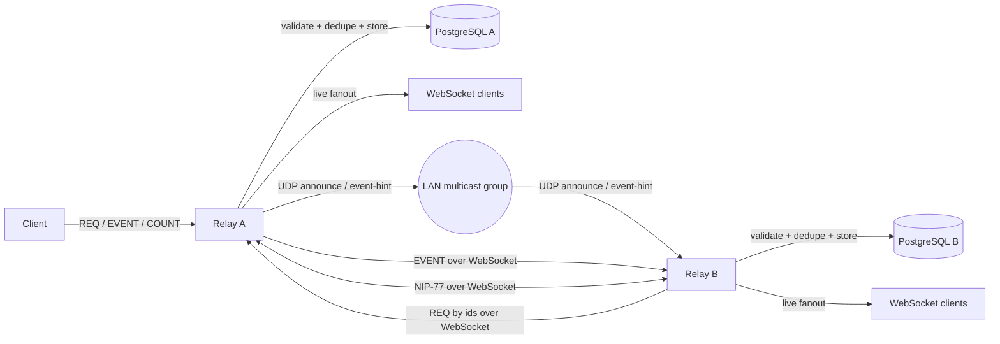

# Local-First Sync & Performance Engine for Nostream

## Name and Contact Information

**Applicant:** Mahmoud Khedr  
**Email:** [mahmoud.s.khedr.2@gmail.com](mailto:mahmoud.s.khedr.2@gmail.com)  
**Location:** Menoufia, Egypt  
**Country:** Egypt  
**Timezone:** Africa/Cairo  
**GitHub:** [Mahmoud-s-Khedr](https://github.com/mahmoud-s-khedr)  
**Telegram:** [@m_s_khedr](https://t.me/m_s_khedr)  
**Discord:** mahmoudkhedr_  
**LinkedIn:** [mahmoud-s-khedr](https://www.linkedin.com/in/mahmoud-s-khedr/)  
**Blog / Website:** [muhandis.software](https://muhandis.software/)  
**University:** Faculty of Electronic Engineering, Menoufia University  
**Degree:** B.E. in Computer Engineering, undergraduate, expected March 2027

---

## Title

**Local-First Sync & Performance Engine for Nostream**

---

## Supporting Video

I included a short supporting video to help mentors quickly review the project scope, architecture, execution plan, and my preparation for the project.

**Video:** [Proposal Walkthrough – Local-First Sync & Performance Engine](https://youtu.be/f6E7JnHAn-E)

---

## Synopsis

This project extends Nostream with indexed NIP-50 search, opt-in LAN relay discovery through UDP multicast, event-hint propagation, and bounded NIP-77 Negentropy reconciliation. The goal is a mergeable local-first synchronization path where nearby relays can discover each other, exchange lightweight availability signals, fetch full events safely, and repair missed state efficiently.

---

## Project Understanding and Motivation

Nostream is already a useful Nostr relay implementation, but the project idea identifies three areas that can make it more capable for relay operators and local relay networks.

First, Nostr clients need better text discovery than exact matching by author, kind, tag, or event ID. NIP-50 defines a standard `search` filter, and PostgreSQL full-text search gives Nostream a practical indexed implementation path.

Second, local relays should be able to find each other on the same network without brittle manual peer configuration. UDP multicast is useful for this, but I do not propose using it as reliable transport. The default design uses UDP only for peer discovery and small event-availability hints.

Third, real-time propagation alone does not guarantee convergence. UDP packets can be dropped, relays can restart, and peers can temporarily diverge. NIP-77 Negentropy provides an efficient repair mechanism so relays can identify missing events without replaying the full dataset.

The proposed architecture is intentionally layered:

| Layer | Responsibility |
| --- | --- |
| PostgreSQL | Indexed NIP-50 search, query-plan validation, and result counting |
| UDP multicast | Opt-in LAN discovery and lightweight event hints |
| WebSockets | Full event transfer using normal Nostr `REQ` / `EVENT` flows |
| NIP-77 Negentropy | Efficient set reconciliation after packet loss, restart, or divergence |
| Multi-relay tests | Verification of discovery, propagation, deduplication, restart recovery, and convergence |

This layering keeps the summer scope realistic. NIP-50 and UDP event hints are independently useful and mergeable; NIP-77 then improves resilience on top of that foundation.

---

## Current State vs Target State

| Area | Current State | Target State |
| --- | --- | --- |
| Search | No NIP-50 search support | Indexed NIP-50 search for `REQ`, with the same predicate applied to NIP-45 `COUNT` |
| Query performance | Existing filter-based PostgreSQL queries | Full-text-search-backed queries with measured plans and index usage |
| Local relay awareness | Manual or static peer configuration | Opt-in LAN peer discovery over UDP multicast |
| Local propagation | WebSocket pub/sub inside a single relay | Event-availability hints between LAN relays |
| Event transfer | Client-relay WebSocket flow | Relay-to-relay fetch by `ids` over WebSocket |
| Repair after loss | No Negentropy-based local repair path | Bounded NIP-77 reconciliation between discovered peers |
| Testing | Mostly single-relay behavior | Multi-relay discovery, packet-loss, restart, and convergence tests |

---

## High-Level Architecture



The key design decision is separation of responsibility: UDP announces that a peer or event exists, WebSocket transfers full events, and Negentropy repairs missed state.

---

## Required and Optional Deliverables

| Deliverable | Type | Required / Optional | Mergeability Goal |
| --- | --- | --- | --- |
| Baseline architecture notes and query measurements | Investigation + documentation | Required | Reviewable early document or PR comment summary |
| NIP-50 filter parsing and validation | Code + tests | Required | Small PR |
| PostgreSQL full-text search predicate and ranking | Code + tests | Required | Small PR |
| FTS migration and benchmark notes | Code + documentation | Required | Small PR |
| NIP-45 `COUNT` search predicate support | Code + tests | Required | Can be included with search PR or split out |
| Runtime `nip50.enabled` setting and NIP-11 advertisement filtering | Code + tests | Required | Small PR |
| Multi-relay test harness skeleton | Test infrastructure | Required | Early PR before network logic grows |
| Local-sync worker and multicast configuration | Code + tests | Required | Separate PR |
| UDP announce, goodbye, and event-hint packets | Code + tests | Required | Separate PR |
| WebSocket fetch by event ID after hint | Code + tests | Required | Separate PR |
| NIP-77 message schemas, routing, and handlers | Code + tests | Required | Separate PR |
| Bounded NIP-77 session and missing-event repair | Code + tests | Required | Separate PR |
| Final resilience tests and documentation | Tests + documentation | Required | Final integration PR |
| Full-event UDP packet mode | Code | Optional | Only if mentor feedback requires it |
| WASM/native Negentropy implementation | Code | Optional | Only if JS implementation becomes a measured bottleneck |
| GiST/trigram/language-specific search improvements | Code + benchmarks | Optional | Only if benchmarks justify them |
| Arabic-aware normalization and multilingual search tests | Code + tests | Optional | Post-program or mentor-directed stretch work |
| Remote/static mirror reuse for Negentropy | Code + tests | Optional | Future extension after LAN flow is stable |

---

## Project Plan

The project is split into five phases. Phase 0 validates the design and current code paths. Phases 1 through 3 implement search, local sync, and reconciliation. Phase 4 focuses on integration, resilience, performance validation, documentation, and final polish.

The implementation strategy is to land small, reviewable PRs instead of keeping the full work in one large branch. The most important PR boundaries are filter parsing, query changes, migrations, worker scaffolding, transport abstraction, packet handling, NIP-77 routing, and convergence tests.

---

## Phase 0 — Baseline Measurement and Design Validation

### Goal

Validate the current integration points before changing performance-sensitive query paths or network behavior.

### Work Items

- Map the filter validation path, repository query path, `COUNT` path, live in-memory matching path, WebSocket fanout path, and worker dispatch path.
- Capture baseline PostgreSQL query plans for common relay filters and count queries.
- Scaffold the multi-relay test harness early enough that UDP and NIP-77 work can reuse it.
- Confirm the Negentropy implementation strategy: a JS-first adapter boundary, with WASM/native bindings treated as stretch work.
- Review Notedeck multicast behavior and map the relevant discovery, event notification, dedupe, loop-prevention, and shutdown behavior into Nostream's worker model.
- Identify mentor review points before the implementation becomes expensive to change.

### Expected Output

- Short architecture note or PR description summarizing touched files and integration points.
- Baseline query-plan notes for search-relevant paths.
- Multi-relay harness skeleton with a transport abstraction that supports real multicast locally and mocked transport in CI.

---

## Phase 1 — NIP-50 Search and PostgreSQL Optimization

### Goal

Implement NIP-50 search for `REQ` using PostgreSQL full-text search, relevance-ranked results, live matching support, tests, benchmarks, and consistent `COUNT` behavior.

NIP-50 adds a `search` filter. Nostream should accept this field as a plain string, combine it with normal Nostr filters such as `kinds`, `authors`, `ids`, `since`, and `until`, and return ranked results for search queries. Since Nostream supports NIP-45 `COUNT`, the same search predicate should also apply to count queries.

### Source Files and Components

| Area | Expected Files / Components |
| --- | --- |
| Filter typing | `src/@types/subscription.ts` |
| Filter validation | `src/schemas/filter-schema.ts` |
| Repository query construction | `src/repositories/event-repository.ts` |
| Live subscription matching | `src/utils/event.ts` |
| Runtime settings | `src/@types/settings.ts`, `default-settings.yaml` |
| NIP-11 advertisement | root request / relay info handler path |
| Tests | repository tests, schema tests, live matching tests, integration tests |
| Migration | Knex migration for FTS index |

### Work Items

- Add `search?: string` to the `SubscriptionFilter` interface.
- Add `search` as an explicit `z.string().optional()` field in `filterSchema`, before `.catchall()`.
- Add `'search'` to `knownFilterKeys` so NIP-50 search is not rejected as an unknown key.
- Update `applyFilterConditions()` to add a PostgreSQL full-text search predicate when `search` is present.
- Update `findByFilters()` so search queries are ranked by `ts_rank()` with deterministic tie-breakers: `event_created_at DESC`, then `event_id ASC`.
- Keep non-search queries on the existing time-based ordering path.
- Update `countByFilters()` so it applies the same search predicate without search ranking.
- Preserve existing deleted/expired-event behavior unless mentors explicitly want that asymmetry addressed.
- Add a PostgreSQL full-text search index over `event_content`.
- Update live in-memory subscription matching in `isEventMatchingFilter()` with conservative normalized text matching.
- Add parity tests that document accepted differences between PostgreSQL FTS tokenization and the simpler live matcher.
- Add benchmark coverage for representative NIP-50 query shapes.
- Add `nip50.enabled` to settings, following the existing `nip45.enabled` pattern.
- Conditionally advertise NIP-50 in NIP-11 relay information only when `nip50.enabled` is true.

### Database Strategy

The first implementation will use PostgreSQL full-text search with a GIN expression index over `event_content`.

```sql
CREATE INDEX CONCURRENTLY IF NOT EXISTS events_content_fts_idx
ON events USING GIN (
  to_tsvector('simple', coalesce(event_content, ''))
);
```

The migration should not run inside a transaction, because `CREATE INDEX CONCURRENTLY` cannot run inside a transaction block. It will follow Nostream's existing migration pattern using `exports.config = { transaction: false }`.

GIN is the default because the search workload is expected to be lookup-heavy. I will still measure insert/update overhead because relays are write-heavy. GiST, trigram fallback, language-specific configurations, and Arabic-aware normalization remain optional unless benchmarks or mentor feedback justify them.

### Initial Query Shape

```ts
if (filter.search) {
  query.whereRaw(
    "to_tsvector('simple', coalesce(event_content, '')) @@ plainto_tsquery('simple', ?)",
    [filter.search]
  )
}
```

Search ranking should only apply when `search` is present:

```ts
if (hasSearchFilter) {
  query
    .select(knex.raw(
      "ts_rank(to_tsvector('simple', coalesce(event_content, '')), plainto_tsquery('simple', ?)) as search_rank",
      [filter.search]
    ))
    .orderBy('search_rank', 'desc')
    .orderBy('event_created_at', 'desc')
    .orderBy('event_id', 'asc')
} else {
  query.orderBy('event_created_at', 'desc')
}
```

This code is illustrative. The actual PR will follow the repository's existing Knex structure.

---

## Phase 2 — Safe UDP Multicast Discovery and Event-Hint Propagation

### Goal

Add opt-in LAN discovery and low-latency event-availability hints without making UDP multicast responsible for reliable event transfer.

### Source Files and Components

| Area | Expected Files / Components |
| --- | --- |
| Worker registration | `src/index.ts`, `src/app/app.ts` |
| Local sync worker | new local-sync worker module |
| Settings | `Settings`, `default-settings.yaml` |
| Packet types | new local sync packet type definitions |
| Transport abstraction | real `dgram` transport + mocked test transport |
| Peer state | peer registry with timeout handling |
| Event fetch | WebSocket client path using `REQ` by `ids` |
| Fanout integration | cluster IPC via `process.send` / `onClusterMessage` |
| Tests | two-relay and three-relay propagation tests |

### Work Items

- Add a dedicated `local-sync` worker registered as a new `WORKER_TYPE` and forked from the primary process.
- Follow the existing worker pattern used by static mirroring instead of placing multicast membership in every client worker.
- Add multicast configuration under a new `localSync` section in `default-settings.yaml` and `Settings`.
- Keep local sync disabled by default and require explicit operator configuration.
- Implement `announce`, `goodbye`, and `event-hint` packets.
- Keep default event hints limited to `eventId` and `relayUrl`.
- Add origin suppression, message deduplication, TTL checks, stable relay IDs, and packet-size limits.
- Fetch full events over WebSocket using normal `REQ` by `ids` after receiving an event hint.
- Ensure fetched events go through the same validation, admission, expiration, dedupe, and storage path as normal client-submitted events.
- Integrate with the cluster IPC bus so events fetched by the local-sync worker can reach client workers for live fanout.
- Add a testable transport abstraction so CI can use mocked multicast behavior.

### Packet Model

```ts
type AnnouncePacket = {
  protocol: 'nostream-local-sync'
  version: 1
  kind: 'announce'
  messageId: string
  originRelayId: string
  relayUrl: string
  ttl: number
  sentAt: number
}

type GoodbyePacket = {
  protocol: 'nostream-local-sync'
  version: 1
  kind: 'goodbye'
  messageId: string
  originRelayId: string
  relayUrl: string
  ttl: number
  sentAt: number
}

type EventHintPacket = {
  protocol: 'nostream-local-sync'
  version: 1
  kind: 'event-hint'
  messageId: string
  originRelayId: string
  relayUrl: string
  eventId: string
  ttl: number
  sentAt: number
}

type LocalSyncPacket = AnnouncePacket | GoodbyePacket | EventHintPacket
```

A discriminated union on `kind` keeps packet validation explicit and makes exhaustive handling easier in TypeScript.

### Event-Hint Flow

1. Relay A accepts, validates, deduplicates, and stores a client `EVENT`.
2. Relay A sends a UDP `event-hint` containing `eventId` and `relayUrl`.
3. Relay B receives the hint and applies origin, TTL, packet-size, and duplicate checks.
4. If Relay B does not already have the event, it fetches it from Relay A over WebSocket using `REQ` by `ids`.
5. Relay B validates, stores, and fans out the fetched event through the normal path.
6. If a hint is missed, NIP-77 reconciliation repairs the gap later.

### Notedeck Multicast Parity Plan

For Notedeck multicast parity, I will map the reference behavior into Nostream's Node.js worker model around multicast group configuration, peer discovery, packet versioning, event notification, self-origin suppression, duplicate suppression, loop prevention, safe shutdown, and two-relay/three-relay tests.

If mentors prefer full-event UDP payloads for small events, I will implement that as an explicitly configured mode with strict packet-size limits and the same validation/deduplication path used by WebSocket-fetched events. I do not propose it as the default path because UDP does not provide reliable delivery, ordering, or backpressure.

---

## Phase 3 — NIP-77 Negentropy Reconciliation

### Goal

Add bounded NIP-77 reconciliation so relays can repair missed state after packet loss, missed event hints, restart, temporary disconnects, or partial divergence.

NIP-77 identifies which event IDs differ between peers. Actual event transfer should still happen through normal Nostr messages such as `REQ` and `EVENT`, keeping reconciliation separate from transport.

### Source Files and Components

| Area | Expected Files / Components |
| --- | --- |
| Message enum | `src/@types/messages.ts` |
| Message types | `NegOpenMessage`, `NegMsgMessage`, `NegCloseMessage`, `NegErrMessage` |
| Zod validation | `src/schemas/message-schema.ts` |
| Handlers | `NegOpenMessageHandler`, `NegMsgMessageHandler`, `NegCloseMessageHandler` |
| Handler factory | `src/factories/message-handler-factory.ts` |
| Settings | `nip77.enabled`, session limits, timeout limits |
| Repository streams | ordered `(event_created_at, event_id)` event streams |
| Sync scheduler | repair windows after peer discovery and periodically |
| Fetch path | missing event fetch over WebSocket using `REQ` by `ids` |

### Message Routing Integration

NIP-77 introduces four message types: `NEG-OPEN`, `NEG-MSG`, `NEG-CLOSE`, and `NEG-ERR`.

The implementation will require updates to the message enum, TypeScript message interfaces, Zod validation schemas, incoming/outgoing message unions, handler classes, the message handler factory, and bounded session lifecycle management.

### Work Items

- Implement message schema and routing support first, before building full reconciliation logic.
- Add session lifecycle management with timeout cleanup.
- Add repository methods for ordered event ID streams used to construct reconciliation sets.
- Keep the Negentropy implementation behind a narrow adapter boundary.
- Start with a JS implementation unless benchmarks show this is a bottleneck.
- Fetch missing events over WebSocket using normal `REQ` by `ids`.
- Add chunking, pacing, and backpressure controls for large diffs.
- Trigger reconciliation after peer discovery and during periodic repair windows.
- Conditionally advertise NIP-77 in NIP-11 relay information only when `nip77.enabled` is true.
- Return `NEG-ERR` for malformed, unsupported, oversized, expired, or policy-blocked sessions.

### Simplified Session Flow

```text
Relay A discovers Relay B
Relay A opens a bounded reconciliation session with Relay B
Relay A and Relay B exchange NEG-MSG messages
Both sides identify event IDs missing from their local stores
Each side fetches missing events using normal REQ-by-ids over WebSocket
Fetched events pass through normal validation and deduplication
Session closes or times out
```

---

## Phase 4 — Integration, Resilience, Performance Validation, and Documentation

### Goal

Prove that the combined system works under realistic multi-relay conditions and is understandable for future maintainers and operators.

### Multi-Relay Test Harness

The existing integration setup is mostly single-relay. This project needs a harness that can model multiple relays with separate databases and stable relay identities.

The harness will support:

- two-relay discovery,
- three-relay loop-prevention tests,
- event-hint propagation,
- duplicate hint suppression,
- relay restart recovery,
- packet loss simulation,
- convergence after reconciliation,
- benchmark and query-plan verification for search.

Docker bridge networks do not always make UDP multicast reliable in CI, so I will use a transport abstraction. Local development can use real Node.js `dgram` multicast. CI can use a mocked transport that simulates duplication, loss, and reordering.

### Example Resilience Scenario

```gherkin
Scenario: Event hints plus Negentropy converge after packet loss
  Given three relays on the same local-sync configuration
  And relay B drops 30 percent of inbound event hints for 60 seconds
  When 500 events are published to relay A
  Then relay C receives event hints and fetches events over WebSocket
  And relay B eventually converges to the same event ID set after NIP-77 repair
  And reconciliation traffic is lower than full replay
```

---

## Project Timeline

The Summer of Bitcoin 2026 coding period runs from **May 18, 2026 to August 16, 2026**. Midterm evaluations run from **June 29, 2026 to July 3, 2026**.

| Period | Focus | Main Work | Expected Output |
| --- | --- | --- | --- |
| **May 11 – May 17** | Pre-coding preparation | Final mentor feedback, scope confirmation, issue/PR breakdown, local environment checks | Final proposal scope and PR plan |
| **May 18 – May 24** | Baseline validation | Map query/live/worker paths, collect baseline query plans, scaffold multi-relay harness | Architecture notes + baseline measurements |
| **May 25 – June 2** | NIP-50 foundations | Add `search` typing, schema validation, known key handling, tests | Filter parsing PR |
| **June 3 – June 11** | NIP-50 repository support | Add FTS predicate, ranking, deterministic ordering, count predicate support | Query implementation PR |
| **June 12 – June 23** | NIP-50 migration and validation | Add GIN migration, benchmarks, live matcher, NIP-11 runtime advertisement | NIP-50 complete or in final review |
| **June 24 – June 28** | Local sync scaffolding | Add worker registration, settings, peer registry, transport abstraction | Local-sync scaffold PR |
| **June 29 – July 3** | Midterm checkpoint | Stabilize NIP-50, show local-sync worker running, validate NIP-77 adapter design | Midterm-ready state |
| **July 4 – July 12** | UDP discovery and event hints | Implement announce, goodbye, event-hint, origin suppression, TTL, dedupe | LAN discovery + hint propagation PR |
| **July 13 – July 21** | WebSocket fetch and fanout | Fetch full events by `ids`, route fetched events through normal validation/storage/fanout | Event transfer PR |
| **July 22 – July 30** | NIP-77 routing | Add message enum values, schemas, handlers, factory routing, settings | NIP-77 routing PR |
| **July 31 – August 7** | NIP-77 reconciliation | Implement bounded sessions, repository streams, missing-event fetch, session cleanup | Reconciliation PR |
| **August 8 – August 13** | Resilience and performance validation | Packet-loss tests, restart tests, convergence tests, benchmark summary | Final test and benchmark PR |
| **August 14 – August 16** | Final polish | Documentation, cleanup, mentor feedback, final submission notes | Final submission |

---

## Time Commitment and Availability

I will treat this project as my primary technical commitment during the program.

| Period | Availability | Notes |
| --- | ---: | --- |
| **April 23 – May 17** | Before core coding | Part-time/freelance commitments end before the main project period. I will use this time for mentor feedback, proposal cleanup, and local setup. |
| **May 18 – June 23** | At least **20 hours/week** | University exams overlap with the early coding period. I planned the early work around isolated tasks: validation, schema changes, query changes, migrations, benchmarks, and tests. |
| **June 24 – August 16** | At least **30 hours/week** | Post-exam period is reserved for multicast implementation, NIP-77 reconciliation, multi-relay testing, and final integration. |

I will communicate progress through regular GitHub updates, small PRs, and clear PR descriptions. If a design decision becomes unclear, I will prepare a concrete option comparison for mentors instead of asking open-ended questions.

---

## Success Metrics

| Area | Success Metric |
| --- | --- |
| NIP-50 validation | `search` is accepted as a string filter, and unknown non-tag keys remain rejected |
| NIP-50 query support | `REQ` supports NIP-50 search combined with normal Nostr filters |
| `COUNT` consistency | NIP-45 `COUNT` applies the same search predicate used by retrieval |
| Search ranking | Search results are ranked by relevance with deterministic tie-breakers |
| Search performance | Representative search queries use the intended PostgreSQL FTS index |
| Search write overhead | Insert/update impact of the FTS index is measured and documented |
| Runtime metadata | Relay advertises NIP-50 only when `nip50.enabled` is true |
| UDP discovery | Two or more local relays discover each other when local sync is enabled |
| UDP safety | Default UDP packets are bounded and carry hints, not full event payloads |
| Event propagation | A relay receiving an event hint fetches the full event over WebSocket |
| Deduplication | Duplicate hints do not create duplicate rows or repeated fanout loops |
| Loop prevention | A three-relay topology does not create infinite rebroadcast loops |
| NIP-77 routing | `NEG-OPEN`, `NEG-MSG`, `NEG-CLOSE`, and `NEG-ERR` are parsed, validated, and routed |
| NIP-77 repair | A relay that missed event hints converges after reconciliation |
| Restart recovery | A restarted relay repairs missing state through NIP-77 |
| CI stability | Multi-relay scenarios pass using mocked transport; real multicast is tested locally |

---

## Risks and Mitigations

| Risk | Mitigation |
| --- | --- |
| FTS search predicates or ranking cause query regressions | Benchmark before and after, verify plans with `EXPLAIN ANALYZE`, keep the first index narrow, and evaluate alternatives only if needed |
| GIN index adds unacceptable write overhead | Measure insert/update impact and compare alternatives such as GiST only if benchmarks justify it |
| Production migration safety issues | Use `CREATE INDEX CONCURRENTLY` and disable migration transactions for that migration |
| `filterSchema` catchall rejects `search` | Add `search` explicitly before `.catchall()` and add it to `knownFilterKeys` |
| Stored search and live matching behave differently | Implement both paths, document the difference, and add parity tests for accepted behavior |
| Non-search ordering changes accidentally | Apply `ts_rank()` ordering only when `search` is present |
| UDP packet loss, duplication, reordering, or loops | Use hints only by default, fetch full events over WebSocket, and add relay IDs, message IDs, seen-cache dedupe, TTL, and origin suppression |
| Mentor expects closer Notedeck parity | Keep hint-only UDP as safe default; add small full-event UDP mode only behind explicit configuration if requested |
| Docker multicast is unreliable in CI | Use transport abstraction with mocked multicast semantics in CI and real `dgram` multicast for local testing |
| Clustered workers duplicate multicast membership | Isolate multicast membership in one local-sync worker |
| NIP-77 sessions become expensive or abusive | Add filter bounds, session limits, message-size limits, timeouts, per-peer cooldowns, and `NEG-ERR` rejection |
| NIP-77 implementation takes longer than expected | Keep NIP-50 and UDP local sync independently mergeable; develop NIP-77 behind an adapter and narrow session scope |
| Operator privacy concerns | Keep local sync disabled by default, require explicit configuration, avoid full-event UDP payloads by default, and document network behavior clearly |

---

## Future Deliverables After Summer of Bitcoin

After the program, I would like to continue improving Nostream's relay performance and synchronization capabilities. The most likely follow-up work would be:

- extend Negentropy reconciliation to configured remote/static mirrors;
- compare GiST, GIN, and trigram strategies against real relay workloads;
- add language-specific search configuration where useful;
- add optional Arabic-aware normalization and multilingual search tests;
- improve observability for local sync, including peer counters and reconciliation metrics;
- create operator-focused examples for small LAN relay clusters;
- continue reviewing issues and contributing bug fixes in Nostream.

---

## Benefits to Community

This work benefits Nostream operators, Nostr client developers, and the broader Nostr ecosystem.

For relay operators, NIP-50 search gives a standards-based way to support text search with measurable PostgreSQL index behavior. For local relay users, opt-in multicast discovery reduces manual configuration while keeping full event transfer inside normal relay protocols. For the broader ecosystem, the NIP-77 work demonstrates a practical convergence model: fast hints for low latency, normal WebSocket flows for event transfer, and reconciliation for correctness after missed events.

The project would show that local-first relay behavior can be added in layers without weakening validation, deduplication, operator control, or testability.

---

## Biographical Information

I am a Computer Engineering undergraduate at the Faculty of Electronic Engineering, Menoufia University. I focus mainly on backend engineering, databases, DevOps, and production-oriented system design.

My core stack includes Node.js, TypeScript, PostgreSQL, MySQL, Redis, Docker, Linux, and Nginx. This matches Nostream's TypeScript/PostgreSQL/Redis/Linux-oriented architecture directly.

I have practical experience building backend systems, database-backed APIs, Dockerized deployments, and performance-conscious tools. One example is my `backgen` project, which generates backend scaffolding from a Prisma schema. This reflects the same engineering style I want to apply here: understand the structure of a system, automate repeatable paths, test the output, and keep the result usable for real developers.

I am a good fit for this project because I have already spent time with Nostream's codebase, completed competency-test work around the project's core technical areas, and contributed to the upstream repository. This proposal is based on hands-on repository exploration rather than only reading the project idea.

---

## Competency Test and Prior Contributions

To prepare for this proposal, I completed competency-test work for both the earlier simpler version of the project idea and the current expanded Local-First Sync & Performance Engine scope.

### Competency Tests

- **[UDP multicast test](https://github.com/Mahmoud-s-Khedr/nostream/blob/idea-test-001/docs/UDP_MULTICAST_NOSTR.md):** validated multicast setup, packet transmission, event parsing, sender/receiver roles, and transport metrics in Node.js.
- **[Raw WebSocket test](https://github.com/Mahmoud-s-Khedr/nostream/blob/idea-test-002/docs/RAW_WEBSOCKET.md):** verified relay behavior using `REQ`, `EVENT`, `CLOSE`, `COUNT`, `EOSE`, `OK`, `NOTICE`, and `CLOSED`.
- **[Migration test](https://github.com/Mahmoud-s-Khedr/nostream/blob/idea-test-003/docs/events-test-column-migration.md):** practiced Nostream's Knex migration workflow by applying, rolling back, and verifying a reversible schema change.

### Upstream Nostream Contributions

- **[5 merged pull requests](https://github.com/cameri/nostream/pulls?q=is%3Amerged+is%3Apr+author%3AMahmoud-s-Khedr+)** in the upstream repository.
- **[Issue #535: Migrate scripts to unified CLI/TUI using `cac` and `@clack/prompts`](https://github.com/cameri/nostream/issues/535)**.

These contributions helped me understand the repository structure, review workflow, TypeScript conventions, migration patterns, and the practical expectations for mergeable work.

---

## References and Resources

- [Nostream repository][nostream]
- [NIP-50: Search Capability][nip50]
- [NIP-45: Event Counts][nip45]
- [NIP-77: Negentropy Syncing][nip77]
- [Node.js UDP/datagram sockets][node-dgram]
- [PostgreSQL full-text search indexes][pg-fts-indexes]
- [PostgreSQL CREATE INDEX][pg-create-index]
- [Summer of Bitcoin schedule][sob-schedule]
- [Summer of Bitcoin guide: Writing a winning project proposal][sob-proposal-guide]

---

## Closing Statement

This proposal gives Nostream a practical path toward local-first relay behavior: indexed search, opt-in LAN discovery, safe event transfer, and bounded reconciliation. The required scope is designed as a sequence of small, reviewable deliverables, while the optional work remains clearly separated.

The plan is grounded in Nostream's current architecture, my competency-test work, and my prior contributions. The success criteria are measurable: search correctness, query-plan validation, safe local-sync behavior, restart recovery, and tested multi-relay convergence.

[nostream]: https://github.com/cameri/nostream
[nip50]: https://nips.nostr.com/50
[nip45]: https://nips.nostr.com/45
[nip77]: https://nips.nostr.com/77
[node-dgram]: https://nodejs.org/api/dgram.html
[pg-fts-indexes]: https://www.postgresql.org/docs/current/textsearch-indexes.html
[pg-create-index]: https://www.postgresql.org/docs/current/sql-createindex.html
[sob-schedule]: https://www.summerofbitcoin.org/how-it-works
[sob-proposal-guide]: https://guide.summerofbitcoin.org/the-proposal-round/writing-a-winning-project-proposal
